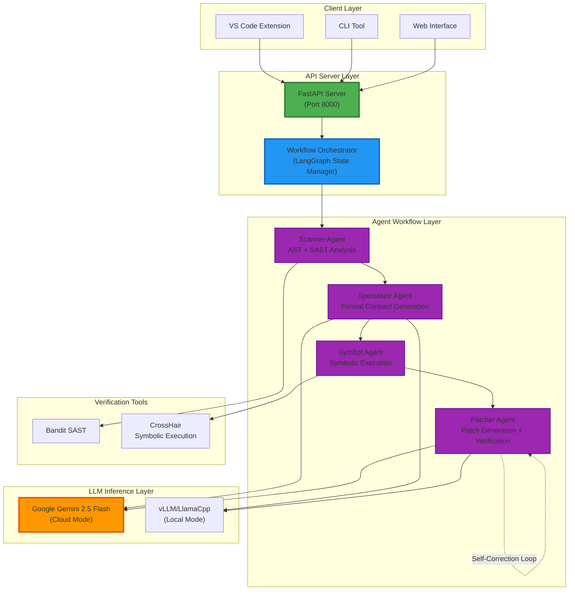
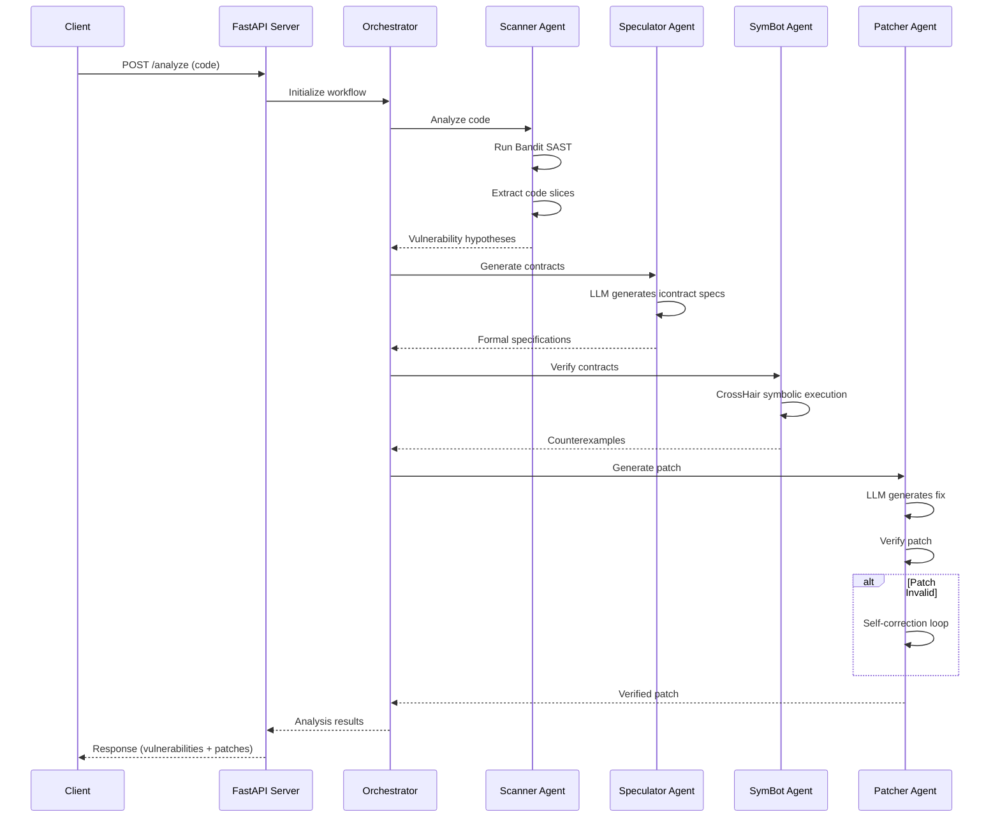

<div align="center">
  
# **SecureCodeAI**
  


**Neuro-Symbolic Vulnerability Detection and Automated Patching**

An intelligent security analysis system combining Large Language Models with symbolic execution for automated vulnerability detection and patching in source code.

[Quick Start](#-quick-start) • [Features](#-features) • [Architecture](#-architecture) • [API Documentation](#-api-reference) • [Deployment](#-deployment)

</div>

---

## Overview

SecureCodeAI is a production-ready security analysis platform that uses a multi-agent architecture powered by LLMs (Google Gemini or local DeepSeek models) combined with formal verification techniques. The system automatically identifies security vulnerabilities, generates formal specifications, verifies them through symbolic execution, and produces verified security patches.

### Key Capabilities

- **Automated Detection**: Static analysis enhanced with LLM-powered vulnerability hypothesis generation
- **Formal Verification**: Symbolic execution using CrossHair to mathematically prove vulnerabilities
- **Intelligent Patching**: Self-correcting patch generation with verification loops
- **Multi-Agent Workflow**: Coordinated Scanner → Speculator → SymBot → Patcher pipeline
- **Production Scale**: FastAPI server with health monitoring, rate limiting, and auto-scaling support

---

## Features

| Feature | Description |
|---------|-------------|
| **Hybrid Analysis** | Combines SAST (Bandit) with LLM semantic understanding |
| **Formal Verification** | Mathematical proof of vulnerabilities via symbolic execution |
| **Multi-Agent System** | Specialized agents for scanning, speculation, verification, and patching |
| **High Performance** | Powered by Google Gemini 2.5 Flash or local vLLM/LlamaCpp |
| **Containerized** | Docker and Docker Compose deployment ready |
| **Serverless Ready** | Optimized for RunPod with auto-scaling |
| **Production API** | FastAPI with monitoring, rate limiting, and health checks |
| **VS Code Extension** | Real-time vulnerability detection in your editor |

### Supported Vulnerability Types

- SQL Injection
- Command Injection
- Path Traversal
- Cross-Site Scripting (XSS)
- Hardcoded Credentials
- Insecure Deserialization
- Server-Side Request Forgery (SSRF)

---

## Architecture



### Agent Workflow



---

## Quick Start

### Prerequisites

- **Python**: 3.10 or higher
- **RAM**: 8GB minimum (16GB recommended)
- **Storage**: 20GB free space
- **Optional**: GPU with 24GB VRAM for local models

### 1. Cloud Mode (Recommended - Free Tier Available)

```bash
# Get free Gemini API key from: https://makersuite.google.com/app/apikey

# Clone and configure
git clone https://github.com/Keerthivasan-Venkitajalam/secure-code-ai.git
cd secure-code-ai

# Set up environment
cp deployment/.env.example .env
# Edit .env and set: SECUREAI_GEMINI_API_KEY=your_key_here

# Start with Docker Compose (Recommended)
cd deployment
docker-compose up -d

# Or start manually
pip install -r requirements.txt
export SECUREAI_USE_GEMINI=true
export SECUREAI_GEMINI_API_KEY=your_key_here
python -m api.server
```

**API available at**: `http://localhost:8000`  
**Interactive docs**: `http://localhost:8000/docs`

### 2. Local Mode (Private, No API Keys)

```bash
# Clone repository
git clone https://github.com/Keerthivasan-Venkitajalam/secure-code-ai.git
cd secure-code-ai

# Install dependencies
pip install -r requirements.txt

# Download model (automatic on first run, or manually)
huggingface-cli download bartowski/DeepSeek-Coder-V2-Lite-Instruct-GGUF \
    --include "DeepSeek-Coder-V2-Lite-Instruct-Q2_K.gguf" \
    --local-dir models/deepseek-q2

# Start server
export SECUREAI_MODEL_PATH=models/deepseek-q2
python -m api.server
```

### 3. Test the API

```bash
# Health check
curl http://localhost:8000/health

# Analyze vulnerable code
curl -X POST http://localhost:8000/analyze \
  -H "Content-Type: application/json" \
  -d '{
    "code": "query = \"SELECT * FROM users WHERE id=\" + user_id",
    "file_path": "app.py"
  }'
```

---

## Installation Options

### Option A: Docker (Recommended)

```bash
# Using Docker Compose
cd deployment
cp .env.example .env
# Edit .env with your configuration
docker-compose up -d

# View logs
docker-compose logs -f

# Stop services
docker-compose down
```

### Option B: Python Virtual Environment

```bash
# Create environment
conda create -n secureai python=3.10 -y
conda activate secureai

# Install dependencies
pip install -r requirements.txt

# Configure
export SECUREAI_USE_GEMINI=true
export SECUREAI_GEMINI_API_KEY=your_key

# Run
python -m api.server
```

### Option C: VS Code Extension

```bash
cd extension
npm install && npm run compile

# Development: Press F5 in VS Code
# Or package and install:
npm install -g @vscode/vsce
vsce package
code --install-extension securecodai-0.1.0.vsix
```

Configure in VS Code settings:
```json
{
  "securecodai.apiEndpoint": "http://localhost:8000"
}
```

---

## API Reference

### Core Endpoints

#### `POST /analyze`

Analyze code for vulnerabilities and generate patches.

**Request:**
```json
{
  "code": "string",
  "file_path": "string",
  "max_iterations": 3
}
```

**Response:**
```json
{
  "analysis_id": "uuid",
  "vulnerabilities": [
    {
      "location": "line 1",
      "vuln_type": "SQL Injection",
      "severity": "high",
      "description": "User input concatenated into SQL query",
      "confidence": 0.95
    }
  ],
  "patches": [
    {
      "code": "string",
      "diff": "string",
      "verified": true
    }
  ],
  "execution_time": 2.34,
  "workflow_complete": true
}
```

#### `GET /health`

System health check with detailed metrics.

**Response:**
```json
{
  "status": "healthy",
  "vllm_loaded": true,
  "workflow_ready": true,
  "uptime_seconds": 3600.5,
  "request_queue_depth": 0
}
```

### Additional Endpoints

- `GET /health/ready` - Readiness probe for orchestration
- `GET /` - API information and version
- `GET /docs` - Interactive Swagger UI documentation
- `GET /redoc` - ReDoc documentation
- `GET /openapi.json` - OpenAPI schema

---

## ⚙️ Configuration

### Environment Variables

| Variable | Default | Description |
|----------|---------|-------------|
| `SECUREAI_HOST` | `0.0.0.0` | Server bind address |
| `SECUREAI_PORT` | `8000` | Server port |
| `SECUREAI_USE_GEMINI` | `false` | Use Google Gemini (recommended) |
| `SECUREAI_GEMINI_API_KEY` | - | Gemini API key |
| `SECUREAI_MODEL_PATH` | - | Path to local model weights |
| `SECUREAI_ENABLE_GPU` | `true` | Enable GPU acceleration |
| `SECUREAI_MAX_ITERATIONS` | `3` | Max patch refinement iterations |
| `SECUREAI_SYMBOT_TIMEOUT` | `30` | Symbolic execution timeout (s) |
| `SECUREAI_LOG_LEVEL` | `INFO` | Logging level |
| `SECUREAI_RATE_LIMIT` | `10` | Requests per minute limit |

### Configuration File

Create `.env` in project root:

```bash
# LLM Configuration
SECUREAI_USE_GEMINI=true
SECUREAI_GEMINI_API_KEY=your_api_key_here

# Server Configuration
SECUREAI_HOST=0.0.0.0
SECUREAI_PORT=8000

# Performance Tuning
SECUREAI_MAX_ITERATIONS=3
SECUREAI_SYMBOT_TIMEOUT=30
SECUREAI_RATE_LIMIT=10

# Logging
SECUREAI_LOG_LEVEL=INFO
SECUREAI_LOG_FORMAT=json
```

---

## Deployment

### Local Development

```bash
# Quick start script (Windows)
.\scripts\start_local.ps1

# Quick start script (Linux/Mac)
./scripts/start_local.sh
```

### Docker Production

```bash
# Build image
cd deployment
./build.sh --gpu

# Run container
docker run -d \
  --name secureai \
  --gpus all \
  -p 8000:8000 \
  -e SECUREAI_GEMINI_API_KEY=your_key \
  secureai:latest
```

### RunPod Serverless

```bash
# Build and push
docker tag secureai:latest your-registry/secureai:latest
docker push your-registry/secureai:latest

# Deploy using RunPod CLI
./scripts/deploy_runpod.sh
```

**RunPod Configuration:**
- GPU: 24GB VRAM minimum (A5000/A6000/RTX 4090)
- Auto-scaling: Scale to zero after 5 minutes idle
- Cold-start: ~30 seconds
- Cost: $12-40/month based on usage

---

## Development

### Running Tests

```bash
# All tests
pytest

# With coverage
pytest --cov=api --cov-report=html

# Specific test file
pytest tests/test_analyze_integration.py

# Property-based tests
pytest -m property
```

### Load Testing

```bash
# Install Locust
pip install locust

# Run load test
locust -f tests/load_test.py --host=http://localhost:8000

# Or use script
./scripts/run_load_test.sh
```

### Code Quality

```bash
# Format
black api/ agent/ tests/

# Sort imports
isort api/ agent/ tests/

# Type checking
mypy api/

# Linting
ruff check api/ agent/ tests/
```

---

## Performance Benchmarks

| Metric | Target | Typical |
|--------|--------|---------|
| **Throughput** | >1 req/s | 1.2 req/s |
| **Latency (p50)** | <2s | 1.8s |
| **Latency (p95)** | <5s | 4.2s |
| **Latency (p99)** | <10s | 8.5s |
| **Success Rate** | >95% | 97% |

### Resource Requirements

| Environment | CPU | RAM | GPU | Storage |
|-------------|-----|-----|-----|---------|
| **Development** | 4 cores | 8GB | Optional | 20GB |
| **Production** | 8 cores | 16GB | 24GB VRAM | 50GB |
| **Serverless** | Auto | Auto | 24GB VRAM | 50GB |

---

## Troubleshooting

### Common Issues

**Problem: "vLLM engine not loaded"**
```bash
# Solution: Verify model path and GPU availability
export SECUREAI_MODEL_PATH=/path/to/model
export SECUREAI_ENABLE_GPU=true
python -m api.server
```

**Problem: "Connection refused on port 8000"**
```bash
# Solution: Check if port is in use
lsof -i :8000  # Linux/Mac
netstat -ano | findstr :8000  # Windows

# Or use different port
export SECUREAI_PORT=8080
```

**Problem: "Out of memory"**
```bash
# Solution: Reduce GPU memory usage or use CPU mode
export SECUREAI_GPU_MEMORY_UTILIZATION=0.7
# Or disable GPU
export SECUREAI_ENABLE_GPU=false
```

**Problem: "Rate limit exceeded (429)"**
```bash
# Solution: Increase rate limit
export SECUREAI_RATE_LIMIT=20
```

### Debug Logs

```bash
# Docker logs
docker logs secureai-api -f

# Docker Compose logs
docker-compose logs -f api

# Enable debug logging
export SECUREAI_LOG_LEVEL=DEBUG
python -m api.server
```

---

## Project Structure

```
secure-code-ai/
├── api/                      # FastAPI application
│   ├── server.py            # Main API server
│   ├── config.py            # Configuration management
│   ├── models.py            # Pydantic request/response models
│   ├── orchestrator.py      # Workflow orchestrator
│   └── vllm_client.py       # LLM inference client
├── agent/                    # Agent implementations
│   ├── scanner.py           # Scanner agent (Bandit + AST)
│   ├── speculator.py        # Contract generation agent
│   ├── symbot.py            # Symbolic execution agent
│   └── patcher.py           # Patch generation agent
├── deployment/               # Deployment configurations
│   ├── Dockerfile           # Container image definition
│   ├── docker-compose.yml   # Compose configuration
│   └── runpod.yaml          # RunPod serverless config
├── extension/                # VS Code extension
│   ├── src/                 # TypeScript source
│   └── package.json         # Extension manifest
├── tests/                    # Test suite
│   ├── test_*.py            # Unit and integration tests
│   └── load_test.py         # Load testing with Locust
├── scripts/                  # Utility scripts
│   ├── start_local.sh       # Local development script
│   └── deploy_runpod.sh     # RunPod deployment script
├── examples/                 # Example vulnerable code
└── requirements.txt          # Python dependencies
```

---

## Contributing

Contributions are welcome! Please follow these steps:

1. Fork the repository
2. Create a feature branch (`git checkout -b feature/amazing-feature`)
3. Make your changes with tests
4. Format code (`black . && isort .`)
5. Run tests (`pytest`)
6. Commit changes (`git commit -m 'Add amazing feature'`)
7. Push to branch (`git push origin feature/amazing-feature`)
8. Open a Pull Request

---

## License

This project is licensed under the MIT License. See [LICENSE](LICENSE) for details.

---

## Acknowledgments

Built with these excellent open-source projects:

- [DeepSeek-Coder-V2-Lite](https://github.com/deepseek-ai/DeepSeek-Coder) - Base LLM model
- [Google Gemini](https://ai.google.dev/) - Cloud LLM inference
- [vLLM](https://github.com/vllm-project/vllm) - High-performance inference engine
- [LangGraph](https://github.com/langchain-ai/langgraph) - Agent workflow orchestration
- [CrossHair](https://github.com/pschanely/CrossHair) - Symbolic execution engine
- [Bandit](https://github.com/PyCQA/bandit) - Python SAST tool
- [FastAPI](https://fastapi.tiangolo.com/) - Modern web framework

---

<div align="center">

**Built as a part of Software Engineering Course [22AIE311]**

[Report Bug](https://github.com/Keerthivasan-Venkitajalam/secure-code-ai/issues) • [Request Feature](https://github.com/Keerthivasan-Venkitajalam/secure-code-ai/issues)

</div>
