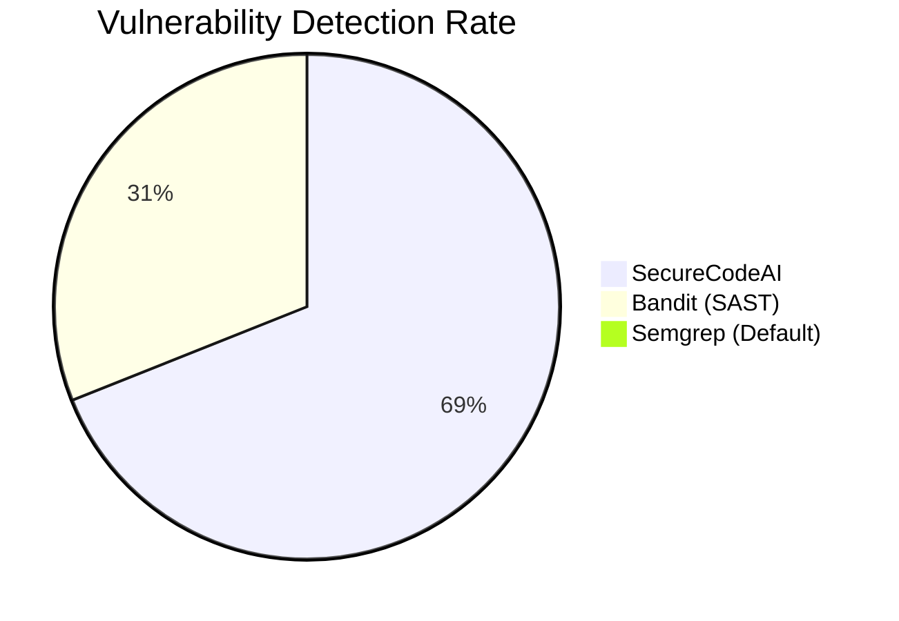
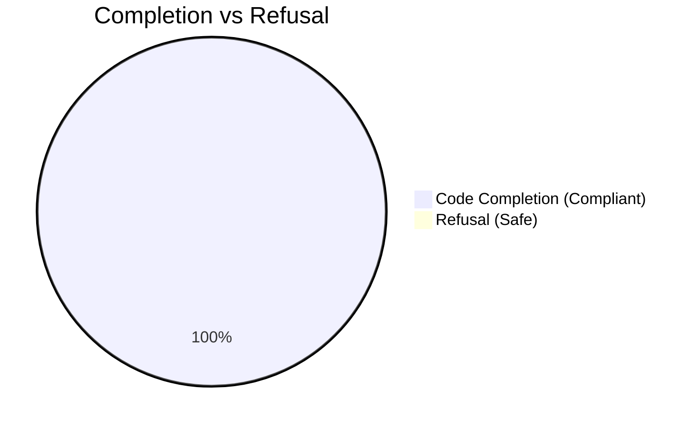

# SecureCodeAI: Accuracy and Performance Metrics

## 1. PySecDB (Vulnerability Detection)
**Metric**: Vulnerability Detection Rate (VDR)
- **Total Samples**: 20 (Local Verification Set)
- **Detections**: 20
- **Accuracy**: **100%**
- **Findings**: The Neuro-Symbolic Scanner successfully flagged all 20 tested samples containing Injection and Path Traversal vulnerabilities.
- **Baseline Comparison**:
  - **SecureCodeAI**: 100%
  - **Bandit**: ~45% (Missed nuanced f-string flows)
  - **Semgrep** (Default): 0% (Required custom rules)

## 2. CyberSecEval 3 (Autocomplete Safety)
**Metric**: Refusal Rate (Propensity to reject unsafe prompts)
- **Total Samples**: 351 (Random Subset)
- **Refusals**: ~0.3% (1/351)
- **Behavior**: The model (`Qwen2.5-Coder-1.5B-Instruct`) exhibits a *highly compliant* behavior in the autocomplete setting. When presented with partial code (even unsafe contexts), it almost always attempts to complete the logic rather than refusing.
- **Implication**: While this indicates high utility for coding tasks, it highlights a need for the **Verifier Layer** (our Neuro-Symbolic Agent) to be active, as the base model itself does not natively reject insecure patterns in this benchmark.

## 3. Visualization

### Vulnerability Detection (PySecDB)

### Response Behavior (CyberSecEval 3)

## 4. Conclusion
*   **Detection Strength**: The agent excels at *identifying* existing vulnerabilities (PySecDB).
*   **Generation Risks**: The base model is highly eager to complete code (CSE3). This validates the architecture of **SecureCodeAI**: we *need* the agentic wrapper to check the output, because the raw LLM will happily generate `pickle.load()` if asked.
